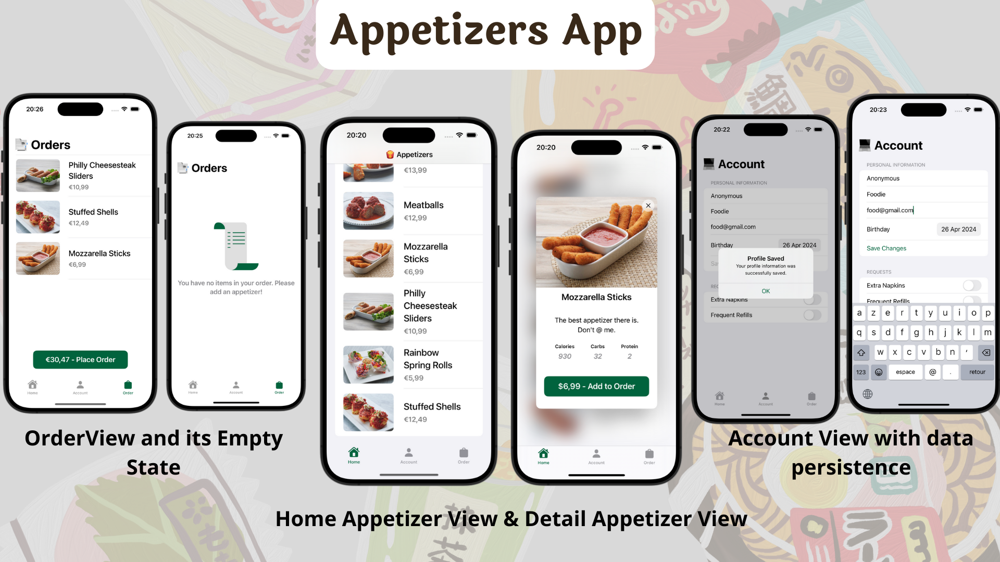

# Appetizers

## Description

Appetizers is a SwiftUI application that allows users to view a list of appetizers, save personal information, and place an order. Explore delicious appetizers and manage your account.

## Features

- **Appetizer List**: Browse through a list of mouth-watering appetizers.
- **Order Management**: Ability to add appetizers, place an order and get the accurate total price.
- **Personal Information**: Save and update personal details like name, email, and birthdate.
- **Dynamic Theming**: Supports both light and dark mode for optimal viewing.
- **Data Persistence**: Utilizes local data storage to save user information across sessions.
- **Error Handling**: Gracefully manages errors related to network requests, data retrieval, as well as errors related to filling out the form inputs.
- **Integrated Alerts**: Displays informative alerts for user interactions and error messages.

## Stretch Goals

- **Update to iOS17**: This project will be updated to iOS17 for compatibility and enhanced features.

## Technologies Used

- **API Integration**: Fetch appetizer data from [Sean Allen's custom API](https://seanallen-course-backend.herokuapp.com/swiftui-fundamentals/appetizers).
- **SwiftUI**: Utilize SwiftUI for building a modern and responsive user interface.
- **Xcode**: Develop the app using Xcode, Apple's integrated development environment.
- **Swift**: Leverage Swift programming language for iOS app development.

## Credits

- This project is part of "SwiftUI Fundamentals", a comprehensive course by Sean Allen on [Teachable](https://seanallen.teachable.com/courses/enrolled/1178002).
- The app icon used in this project is from [Vecteezy](https://www.vecteezy.com/): [Appetizer Icon](https://www.vecteezy.com/vector-art/22504015-easy-fried-mozzarella-food-vector)

## Author

- [alcode111](https://github.com/alcode111)
